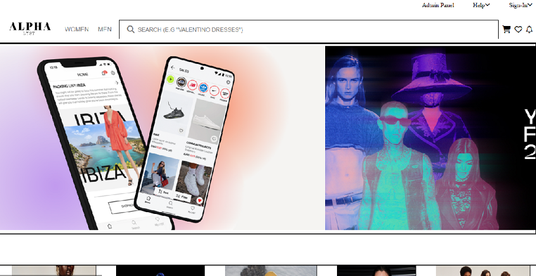

# ALPHY_LYST Fashion E-Commerce Application
Welcome to the ALPHY_LYST Fashion E-Commerce Application! This project showcases a trendy fashion and accessories e-commerce platform where users can explore and purchase stylish apparel and accessories. Our collaborative team of four developers has worked tirelessly over the span of just 4 days to bring you this application, demonstrating various features and functionalities.

<h3 target="blank">Live Demo Link https://symphonious-lebkuchen-33f9c1.netlify.app/ </h3>

<h2>Table of Contents</h2>
<ul>
  <li><a href="#introduction">Introduction</a></li>
  <li><a href="#features">Features</a></li>
  <li><a href="#tech-stack">Tech Stack</a></li>
  <li><a href="#installation">Installation</a></li>
  <li><a href="#usage">Usage</a></li>
  <li><a href="#mock-api">Mock API</a></li>
  <li><a href="#contributors">Contributors</a></li>
  <li><a href="#acknowledgments">Acknowledgments</a></li>
</ul>

<h2 id="introduction">Introduction</h2>

ALPHY_LYST is a web-based fashion and accessories e-commerce platform that offers users a diverse range of trendy apparel and stylish accessories. From a user-friendly navigation bar to a seamless shopping experience, our platform aims to provide customers with the latest fashion trends and a convenient shopping journey.

<h2 id="features">Features</h2>

Our platform comes equipped with the following features:

<ul>
  <li><strong>Landing Page:</strong> An inviting landing page that introduces users to the world of fashion and encourages exploration.</li>
  <li><strong>Navigation Bar:</strong> A user-friendly navigation bar for easy access to different sections of the platform.</li>
  <li><strong>Product Page:</strong> Browse through a wide selection of fashionable apparel and stylish accessories.</li>
  <li><strong>Add to Cart Page:</strong> Easily add desired items to your cart for a seamless shopping experience.</li>
  <li><strong>Payment Page:</strong> Securely process payments to complete your orders.</li>
  <li><strong>Login & Logout Page:</strong> User authentication for personalized shopping experiences.</li>
  <li><strong>Signup Page:</strong> New users can sign up to create an account and start shopping.</li>
  <li><strong>Admin Login & Logout Page:</strong> Special access for administrators to manage the platform.</li>
  <li><strong>Admin Panel:</strong> A dedicated panel for administrators to perform CRUD operations.</li>
  <li><strong>CRUD Operations:</strong> Administrators can create, read, update, and delete products.</li>
  <li><strong>Filtering, Sorting, and Searching:</strong> Effortlessly find products using various filtering, sorting, and searching options.</li>
</ul>

<h2 id="tech-stack">Tech Stack</h2>

  <strong>JavaScript</strong> 
  <strong>HTML</strong> 
  <strong>CSS</strong> 
  <strong>Mock API</strong>

<h2 id="installation">Installation</h2>
    
If you want to run our project in your local machine

    
Follow the given steps:

  <ul>
    <li>Clone our respository <a href="https://github.com/Vchandankumarr/smart-sign-7322">https://github.com/Vchandankumarr/smart-sign-7322</a></li>
    <li>Open our code in VS code </li>
    <li>Congrats !  you have successfully started the application.</li>
  </ul>

<h2 id="usage">Usage</h2>
<ol>
  <li>Open the <code>index.html</code> file in your preferred web browser to access the landing page.</li>
  <li>Navigate through the platform using the provided links in the navigation bar.</li>
  <li>Explore products, add them to your cart, and proceed to checkout.</li>
</ol>

<h2 id="mock-api">Mock API</h2>

We have set up a mock server to simulate interactions with a backend API. This enables data retrieval and manipulation without a live backend connection.

<h2 id="contributors">Contributors</h2>
<ul>
     <li><a href="https://github.com/Vchandankumarr">@Vchandan Kumarr</a></li>
      <li><a href="https://github.com/Ashwin-krish-nan">@Ashwin-krish-nan</a></li>
       <li><a href="https://github.com/Sakshi0704">@Km Sakshi</a></li>
       <li><a href="https://github.com/Yunuslala">@Yunuslala</a></li> 
       <li><a href="https://github.com/sagardeswal123">@Sagar Deswal</a></li> 
</ul>

<h2 id="acknowledgments">Acknowledgments</h2>
    
We would like to express our gratitude to our mentors and peers for their guidance and support during the development of this project.

  
Thank you for visiting ALPHY_LYST Fashion E-Commerce Application! If you encounter any issues or have suggestions for improvements, feel free to reach out to us through the contact information provided in the repository. Wishing you happiness as well!

